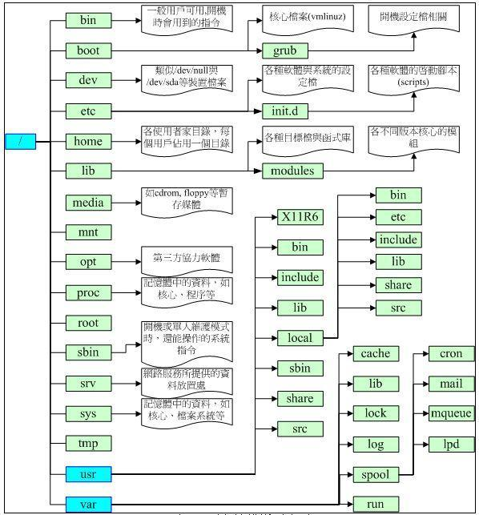

## linux中的常见目录

先上一张图 

再上两个网址

[Linux 各目录及每个目录的详细介绍](http://www.linuxidc.com/Linux/2013-01/77368.htm)

[Linux探索之旅 | 第二部分第三课：文件和目录，组织不会亏待你](http://www.linuxidc.com/Linux/2017-04/143158.htm)

历史遗留的命名问题：

      1. usr =Unix software resource ,

   2. etc：就是and so on ，放一些配置文件，管理文件，杂七杂八的

**/bin **二进制可执行命令

**/dev** 设备特殊文件

**/etc **系统管理和配置文件
**/etc/rc.d** 启动的配置文件和脚本
**/home **用户主目录的基点，比如用户user的主目录就是/home/user，可以用~user表示
/**lib** 标准程序设计库，又叫动态链接共享库，作用类似windows里的.dll文件
/**sbin** 超级管理命令，这里存放的是系统管理员使用的管理程序
/**tmp** 公共的临时文件存储点
/**root** 系统管理员的主目录
/**mnt** 系统提供这个目录是让用户临时挂载其他的文件系统
/**lost+found**这个目录平时是空的，系统非正常关机而留下“无家可归”的文件（windows下叫什么.chk）就在这里
/**proc** 虚拟的目录，是系统内存的映射。可直接访问这个目录来获取系统信息。
/**var** 某些大文件的溢出区，比方说各种服务的日志文件
/**usr** 最庞大的目录，要用到的应用程序和文件几乎都在这个目录，其中包含,相当于windows下的C:\program files\：

**/usr 目录结构**

> /usr/bin : 所有可执行文件，如 gcc，firefox 等（指不包含在 /sbin 和 /bin 内的）；
>
> /usr/include : 各种头文件，编译文件等时需要使用；
>
> /usr/include/’package-name’ : 程序特定的头文件；
>
> /usr/lib : 所以可执行文件所需要的库文件；
>
> **/usr/local : 这里主要存放那些手动安装的软件，即 不是通过“新立得”或apt-get安装的软件 。 它和/usr目录具有相类似的目录结构 。让软件包管理器来管理/usr目录，而把自定义的脚本(scripts)放到/usr/local目录下面，我想这应该是个不错的主意。**
>
> /usr/X11R6 : x 系统的二进制文件，库文件，文档，字体等。它不等同于 /usr 的作用，只有 x 才能调用这些库文件等，其他程序不读取或者使用。因为 linux 没有原生图形界面，而且 linux 大部分情况下是 for server 的，所以图形界面没有意义；其中 X11R6 代表 version 11 release 6；**(ubuntu下貌似没有这个文件夹)**
>
> /usr/X11R6/bin : x 的二进制文件，包含运行 x 的必须文件；
>
> /usr/X11R6/include : x 相关的头文件；
>
> /usr/X11R6/lib : x 库文件；
>
> /usr/X11R6/lib/modules : x 的模块，启动时加载。缺少 video4linux, DRI and GLX 和 输入输出设备 模块，将工作不正常；
>
> /usr/X11R6/lib/X11/fonts : x font server 的字体文件；
>
> /usr/doc : 文档。实际是 /usr/share/doc 的软链接；
>
> /usr/etc : 一个极少用到的配置文件存放地；
>
> /usr/games : 曾经包含游戏等文件，现在很少用到；
>
> /usr/info : 系统相关信息，是 /usr/share/info 的软链接；
>
> /usr/man : man 手册，已经移至 /usr/share/man；
>
> /usr/sbin : 类似 /sbin，root 可以执行。但此目录不包含在环境变量 $PATH 中，它包含的程序类似于 chroot, useradd, in.tftpd and pppconfig；
>
> **/usr/share : 它包含了各种程序间的共享文件，如字体，图标，文档等。（/usr/local 对应的目录是  /usr/loca/share）;** 
>
> /usr/share/doc : 类似应用程序的 man 手册。它包含程序的说明文件，默认配置文件等；
>
> /usr/share/info : 不常用，已经被 man 代替；
>
> /usr/share/man : app 的 manual；
>
> /usr/share/icons : 应用程序的图标等文件，分为 png，svg 等多种格式；
>
> /usr/share/fonts : 字体文件，系统范围内可使用，~/.fonts 仅当前用户可用；
>
> /usr/src : linux 内核的源码和说明文档等；
>
> /usr/src/linux : linux 源代码；
>
> /usr/src/linux/.config : 内核编译过程产生的文件；通常由命令 ‘make config’ ， ‘make menuconfig’ 或 ‘make xconfig’ 执行后产生；
>
> /usr/src/linux/.depend, /usr/src/linux/.hdepend : ‘make dep’ 检测编译依赖时需要的文件，由 /usr/src/linux/.config 产生；
>
> /usr/src/linux/COPYING : GNU license；
>
> /usr/src/linux/Makefile : 编译内核所需的 Makefile；
>
> /usr/src/linux/Rules.make : 当有多个 Makefile 时，根据它的规则执行 make；
>
> /usr/tmp : 已经被众多发行版抛弃的临时文件夹。

## linux下的环境变量

环境变量是系统的运行环境的变量，系统在运行期间，在内存中保存数据，以便脚本和shell上的程序能访问。分为全局变量和局部变量。

使用printenv 可以查看环境变量 。

[Ubuntu系统环境变量详解](http://www.linuxidc.com/Linux/2016-09/135476.htm)

对用户变量来说，一般是执行/etc/envirment ->/etc/profile ->~/.profile 调用 ~/.bashrc

bashrc rc=runcommand

bashrc 是每次打开shell都要执行

source filename 与 sh filename 及./filename执行脚本的区别在那里呢？
1.当shell脚本具有可执行权限时，用sh filename与./filename执行脚本是没有区别得。./filename是因为当前目录没有在PATH中，所有"."是用来表示当前目录的。
2.sh filename 重新建立一个子shell，在子shell中执行脚本里面的语句，该子shell继承父shell的环境变量，但子shell新建的、改变的变量不会被带回父shell，除非使用export。
3.source filename：这个命令其实只是简单地读取脚本里面的语句依次在当前shell里面执行，没有建立新的子shell。那么脚本里面所有新建、改变变量的语句都会保存在当前shell里面。

举例说明：
1.新建一个test.sh脚本，内容为:A=1
2.然后使其可执行chmod +x test.sh
3.运行sh test.sh后，echo $A，显示为空，因为A=1并未传回给当前shell
4.运行./test.sh后，也是一样的效果
5.运行source test.sh 或者 . test.sh，然后echo $A，则会显示1，说明A=1的变量在当前shell中

修改后用source能立即生效，/etc/profile  也可以

## 
